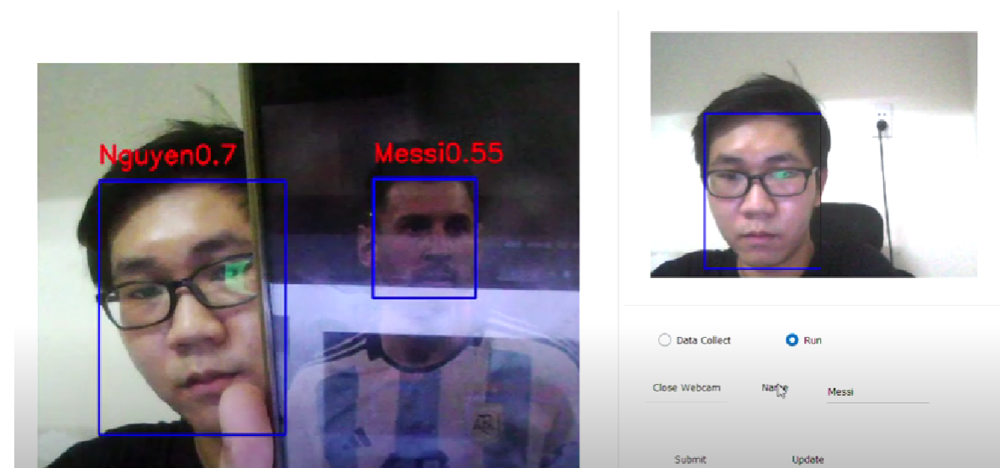

# Face_Recognition
* Use [RetinaFace](https://github.com/biubug6/Pytorch-Retinaface) for Face Detection
* Use [MetaPattern FAS](https://github.com/RizhaoCai/MetaPattern_FAS) for Face - Anti Spoofing
* Use [MagFace+UNPG](https://github.com/jung-jun-uk/unpg) for face recognition
* PyQt5 GUI
## Requirements
* Python 3.7 or later
* Pytorch 1.4 or later
* CUDA  10.2 or later
## Demo (Click to watch)

# File ONNX Model
- [Link Download](https://drive.google.com/drive/folders/1pd3QNagID5KeHwOLr3C_LUB1Sc2CNsln?usp=sharing)
- All files in "Models" are using TRT format. Please convert to TensorRT  format if you want to use it directly. Using "trtexec" of NVIDIA to convert.

